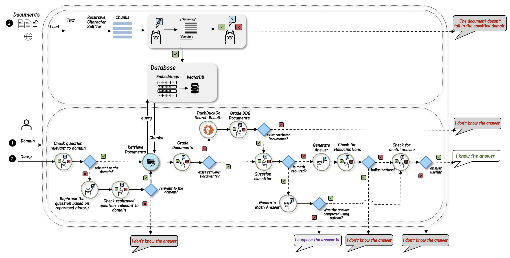

# ChatRetrieveAI README

## Table of Contents

- [Overview](#overview)
- [Graph](#graph)
- [Features](#features)
- [Getting Started](#getting-started)
- [Configuration](#configuration)

## Overview

ChatRetrieveAI is an advanced chatbot application that leverages the Retrieval-Augmented Generation (RAG) approach to provide accurate, domain-specific responses. By integrating user-uploaded documents and external data sources, such as DuckDuckGo, ChatRetrieveAI tailors its interactions to the chosen domain, ensuring that the information provided is both relevant and precise.

Key features include a user-friendly Streamlit interface, domain-specific conversation capabilities, and transparent metadata display, ensuring users have full visibility into the sources of the information provided.

## Graph

The following diagram provides an overview of the project’s architecture, illustrating the key components and workflow of ChatRetrieveAI.



## Features

✅ **Streamlit Interface:** A clean and intuitive interface for seamless interaction with the chatbot.

✅ **Contextual Chat:** Maintains conversation context based on uploaded documents and external sources, tailored to the user-selected domain.

✅ **Domain-Specific Conversations:** Allows users to define a specific domain for more accurate and relevant responses.

✅ **Document Ingestion:** Supports uploading and ingesting various document formats (.txt, .docx, .pdf) or URLs to create a searchable knowledge base.

✅ **Chat History Preservation:** Stores conversation history to maintain context across interactions.

✅ **Metadata Display:** Shows relevant metadata (e.g., filename, page, URL) alongside answers for greater transparency.

## Getting Started

### Prerequisites

- Python: Ensure you have Python 3.8 or higher installed.
- Ollama: Download and install Ollama.

### Installation and Setup

1. #### Download Ollama:
   - Visit the Ollama page and download the software:
     [https://ollama.com](https://ollama.com)
2. #### Pull the Llama3.1 Model:
   - Open a terminal and pull the llama3 model with the following command:
     ```
     ollama pull llama3.1
     ollama pull llama3.1
     ```
3. #### Clone the Repository:
   - Clone the project repository from GitHub:
   ```
   git clone https://github.com/DigitalNikos/ChatRetrieveAI.git
   ```
   ```
   cd ChatRetrieveAI
   ```
4. #### Create a Virtual Environment:
   - Create a Python virtual environment:
   ```
   python -m venv env
   ```
5. #### Activate the Virtual Environment:
   ```
   source env/bin/activate
   ```
6. #### Install the Required Dependencies:
   - Install the dependencies listed in the requirements.txt file:
   ```
   pip install -r requirements.txt
   ```

### Running the Project

1. #### Start the Streamlit Application:
   - Run the Streamlit application with the following command:
   ```
   streamlit run chatbot.py
   ```

## Configuration

The application settings can be modified in the config.py file. Key settings include:

- MODEL: Specifies the language model to use for generating responses.
- SPLITTER_CHUNK_SIZE: Defines the size of text chunks when splitting documents for processing.
- SPLITTER_CHUNK_OVERLAP: Determines how much overlap there should be between chunks to maintain context.
- N_DOCUMENTS_TO_RETRIEVE: Sets the number of documents to retrieve per query to ensure relevance.
- RETRIEVER_SCORE_THRESHOLD: Sets a minimum relevance score for documents to be considered in responses.

## Testing and Compatibility

This project was implemented and tested on a Mac Mini M2 Pro running macOS Sonoma version 14.2.1. Compatibility with other operating systems, including Windows, has not been verified.
